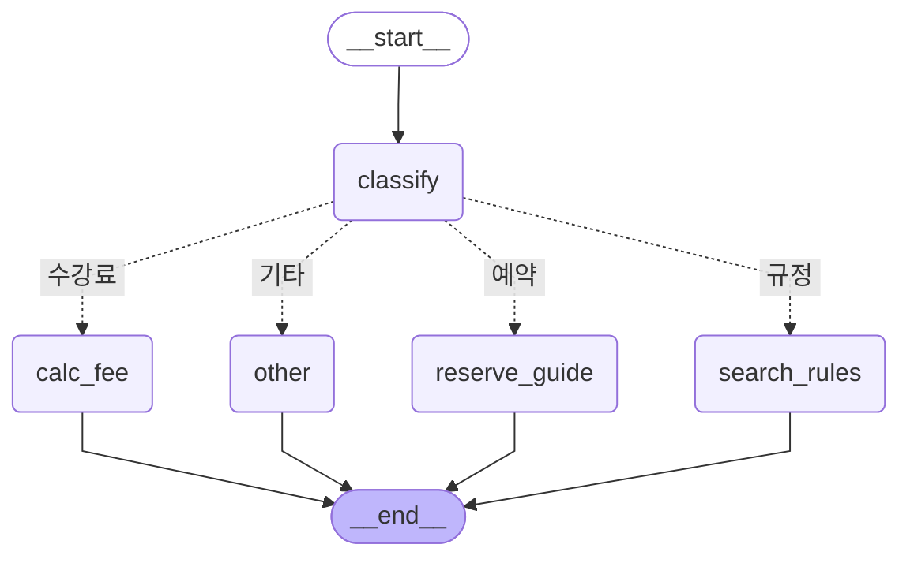

# [5-1] LangGraph 라우팅 그래프

```mermaid
---
config:
  flowchart:
    curve: linear
---
graph TD;
	__start__([<p>__start__</p>]):::first
	classify(classify)
	search_rules(search_rules)
	calc_fee(calc_fee)
	reserve_guide(reserve_guide)
	other(other)
	__end__([<p>__end__</p>]):::last
	__start__ --> classify;
	classify -. &nbsp;수강료&nbsp; .-> calc_fee;
	classify -. &nbsp;기타&nbsp; .-> other;
	classify -. &nbsp;예약&nbsp; .-> reserve_guide;
	classify -. &nbsp;규정&nbsp; .-> search_rules;
	calc_fee --> __end__;
	other --> __end__;
	reserve_guide --> __end__;
	search_rules --> __end__;
	classDef default fill:#f2f0ff,line-height:1.2
	classDef first fill-opacity:0
	classDef last fill:#bfb6fc

```
