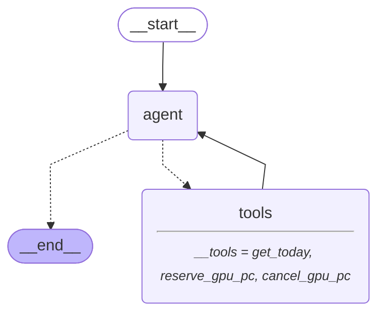

# [5-1] LangGraph 에이전트 · 메모리 (체크포인터)

```mermaid
---
config:
  flowchart:
    curve: linear
---
graph TD;
	__start__([<p>__start__</p>]):::first
	agent(agent)
	tools(tools<hr/><small><em>__tools = get_today, reserve_gpu_pc, cancel_gpu_pc</em></small>)
	__end__([<p>__end__</p>]):::last
	__start__ --> agent;
	agent -.-> __end__;
	agent -.-> tools;
	tools --> agent;
	classDef default fill:#f2f0ff,line-height:1.2
	classDef first fill-opacity:0
	classDef last fill:#bfb6fc

```

## 체크포인터 (InMemorySaver)

- **스레드 ID (thread_id)**: 학번 (HANA-007, HANA-002 등)
- **메모리**: 각 학번별로 대화 히스토리 저장
- **복구**: 같은 학번으로 다시 물으면 이전 대화 맥락 활용
